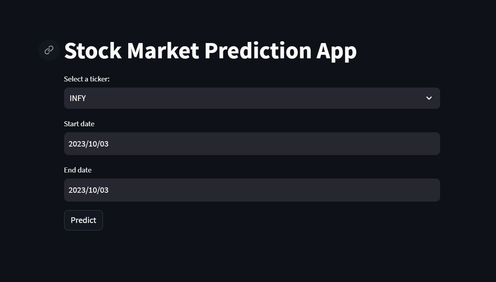
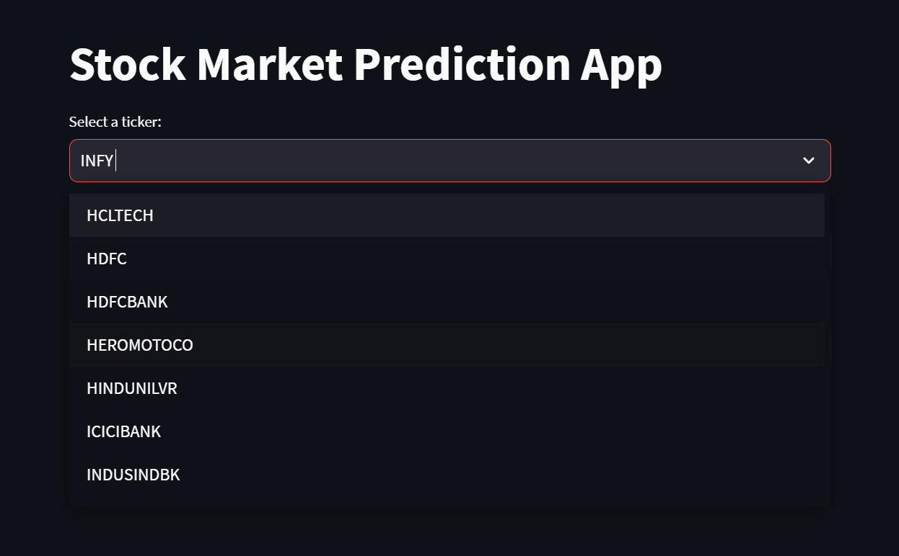

# Stock Market Prediction Project

## Introduction
This project aims to predict stock prices for various companies listed in the Bombay Stock Exchange (BSE) using historical stock data.

## Project Description
Stock markets are complex systems influenced by a myriad of factors, both internal and external. Predicting stock prices has always been a challenging task due to its high volatility and randomness. This project, however, attempts to decode some of this complexity by:

- **Collecting Historical Data**: Fetching comprehensive stock data from reliable sources like Yahoo Finance.
- **Advanced Preprocessing**: Cleaning and transforming the data to make it suitable for modeling.
- **Feature Engineering**: Extracting and creating new features that can provide more insights into the stock's behavior.
- **Modeling**: Using regression models to predict future stock prices based on historical data.
- **Web Interface**: Providing an interactive platform for users to select companies and view predictions.

## Table of Contents
- [Dataset](#dataset)
- [Preprocessing Steps](#preprocessing-steps)
- [Feature Engineering](#feature-engineering)
- [Model Training and Prediction](#model-training-and-prediction)
- [Web App](#web-app)
- [Usage](#usage)
- [Requirements](#requirements)

## Dataset
The dataset consists of historical stock data fetched from Yahoo Finance for various companies listed in the BSE.

## Preprocessing Steps
1. **Handling Missing Values**: Stocks might not be traded on certain days. We've filled these gaps using methods like forward fill.
2. **Outliers**: Identified and handled outliers.
3. **Data Transformation**: 
   - **Normalization/Standardization**: Standardized the closing prices.
   - **Log Transformation**: Applied to stabilize variances.
   - **Date Features Extraction**: Extracted day, month, quarter, and year.

## Feature Engineering
1. **Lagged Features**: Created lagged features for the past 5 days.
2. **Moving Averages**: Calculated moving averages for 30 and 60 days.
3. **RSI**: Calculated the Relative Strength Index.
4. **MACD**: Calculated the Moving Average Convergence Divergence.

## Model Training and Prediction
We've used a Linear Regression model for each company. The model is trained on historical data and can predict stock prices for a given date range.

## Web App
We've developed a Streamlit web app where users can:
- Select a company ticker.
- Choose a date range.
- View the predicted stock prices for the selected date range.

## Usage
1. Clone the repository.
2. Install the requirements using `pip install -r requirements.txt`.
3. Run the Streamlit app using `streamlit run app.py`.

## Requirements
All the required libraries are listed in the `requirements.txt` file.

